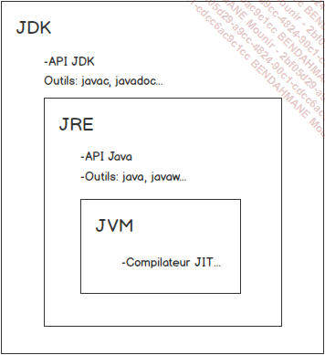

# JAVA BTS SIO

Java existe depuis 20 ans. Java existe maintenant depuis plus de vingt ans. Il a été créé en 1995 par la société Sun Microsystems. Cette société a été rachetée par Oracle en 2009. Java appartient donc maintenant à Oracle.

## Qu'est-ce que Java ?

- Java est un langage oriente objet qui permet d'ecrire des programmes.
- C'est une aussi une plateforme de developpement, Elle est composee d'un ensemble de librairies et d'un ensemble de specifications (JSR: java spefication request) qui decrivent les APIs constituant la plateforme et les outils qui permettent de **compiler**, **debugger** et **executer** les programmes ecrits en Java.

En réalité, il y a plusieurs plateformes.

    La plateforme de base est nommée Java SE (Java Standard Edition) telle qu’indiqué précédemment. Elle répond à la plupart des besoins.
    La seconde plateforme est la plateforme Java EE. Son objectif est de permettre la création d’applications distribuées et notamment d’applications web. Cette plateforme s’appuie sur la plateforme Java SE, mais aussi sur des logiciels tiers, les serveurs d’applications.
    Depuis septembre 2017 et la version Java EE 8, la plateforme a été cédée à la fondation Eclipse. La plateforme s’appelle désormais Jakarta EE et la version actuellement disponible est Jakarta EE9.
    La dernière plateforme se nomme Java Embedded. Ce n’est pas à proprement parler une seule plateforme, mais plutôt un ensemble de plateformes. Elles permettent de réaliser des applications légères pouvant être exécutées sur des appareils embarqués. Elles sont aussi exploitées dans l’Internet des objets. Il est possible de citer plus particulièrement les plateformes Java TV et Java Card. Ce sont en quelque sorte des adaptations allégées de la plateforme Java SE.

- C'est aussi un environnement d'execution (JRE: Java Runtime Environment). Il permet d'executer des programmaes au travers de la JVM ou Java Virtual Machine. L'installation du JRE est necessaire pour executer des programmes Java. (Un developpeur aura besoin d'installer le JDK).

## Les objectifs de la conception de Java

- obtenir un langage et une plateforme simples et performants dont le but est le deploiement et le developpement d'applications.

## Les caracteristiques de Java

Java est :

- simple : trois types primitifs qui sont les numeriques, le caractere et le booleen. Les types numeriques sont tous signés.
- Les tableaux et les String sont des objets.
- Le deveoppeur ne s'occupe de la memoire. Un systeme de garbage collector est present pour liberer la memoire.

En java tout est objet, a l'exception des types primitifs.

JAva est distribué

Java est interprété

Java est robuste

Java est sécurisé

Java est portable

## La plateforme JAVA SE

