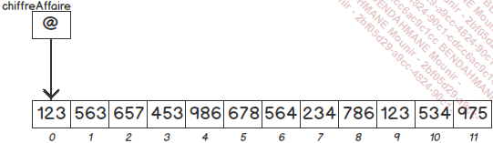
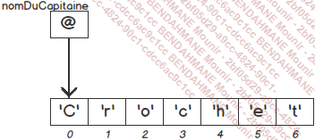

# JAVA

## Les types valeurs en Java

### Les types entiers

Il existe 4 types entiers signés en Java :

- byte **8 bits** la valeur minimale est de -128 et la valeur maximale est de 127
- short 16 bits
- int 32 bits
- long 64bits

Quand vous choisissez un type d'entier prenez en compte la valeur minimale et maximale que vous pouvez stocker dans la variable.

Vous pouvez aussi travailler avec des entiers non signees en utilisant des classes telles que **Integer** ou **Long**. Valeur max pour Long : 18 446 744 073 709 551 616

### Les types decimaux

Il existe 2 types decimaux en Java :

- float 32 bits
- double 64 bits

### Les types caracteres

Le type char est utilisé pour stocker un caractère unique. Une variable de type char utilise deux octets pour stocker le code Unicode du caractère. Dans le jeu de caractères Unicode, les 128 premiers caractères sont identiques au jeu de caractères ASCII, les caractères suivants, jusqu’à 255, correspondent aux caractères spéciaux de l’alphabet latin (par exemple les caractères accentués), le reste est utilisé pour les symboles ou les caractères d’autres alphabets.

Les caractères spécifiques ou ceux ayant une signification particulière pour le langage Java sont représentés par une séquence d’échappement. Elle est constituée du caractère \ suivi d’un autre caractère indiquant la signification de la séquence d’échappement. Le tableau suivant présente la liste des séquences d’échappement et leurs significations.

Sequence d'echappement

```java

    \b  Retour arrière
    \t  Tabulation horizontale
    \n  Saut de ligne
    \f  Saut de page
    \r  Retour chariot
    \"  Guillemet
    \'  Apostrophe
    \\  Antislash

    String s = "Ceci est une chai \" ne de caracteres";
```

Les caractères Unicode non accessibles au clavier sont eux aussi représentés par une séquence d’échappement constituée des caractères \u suivis de la valeur hexadécimale du code Unicode du caractère. Le symbole euro est par exemple représenté par la séquence \u20AC.

```java
char euro = '\u20AC';
```

Lien wiki : https://fr.wikipedia.org/wiki/Table_des_caract%C3%A8res_Unicode

## Les types references en Java

Les tableaux, les chaînes de caractères, les variables complexes sont des variables de types références. Les tableaux permettent de gérer des ensembles de variables (souvent de même type). Les chaînes de caractères permettent de gérer des ensembles de caractères. Les variables complexes permettent elles aussi de gérer un ensemble de variables. Le type des variables complexes est souvent une classe. Par exemple, une classe Personne permet de caractériser une personne en regroupant différentes informations dans autant de variables que nécessaire : le nom (de type String), le prénom (de type String), l’âge (de type int).

### Les tableaux

La manipulation de tableau est decoupee en trois etapes:

- Declaration
- Creation (instanciation, allocation de memoire)
- Stockage des valeurs, manipulation des valeurs du tableau

#### Declaration

```java
int[] tableauEntier;
```

#### Creation

```java
tableauEntier = new int[10];
// ou encore
tableauEntier = {1, 2, 3, 4, 5, 6, 7, 8, 9, 10};
```



Si on tente d'acceder a un element du tableau qui n'existe pas on obtient une erreur de type **ArrayIndexOutOfBoundsException**

### Les chaines de caracteres

Les chaines de caracteres sont des tableaux de caracteres.

```java

String chaine = "Ceci est une chaine de caracteres";

String nomDuCapitaine = "Crochet";
```



Pour declarer une chaine de caracteres on utilise la syntaxe suivante:

```java
String chaineVide;
```

On peut l'initialiser de deux manieres:

```java
chaineVide = "";
//
chaineVide = new String();
```

Java met a disposition des methodes pour manipuler les chaines de caracteres:

```java
String chaine = "Ceci est une chaine de caracteres";
char c = chaine.charAt(0);
```

### Les dates et les heures

Java met a disposition de nombreuses classes pour manipuler les dates et les heures. Les classes les plus utilisees sont:

- **LocalDate** pour manipuler une date
- **LocalDateTime** pour manipuler une date et une heure
- **LocalTime** pour manipuler une heure
- **OffsetDateTime** pour manipuler une date et une heure avec un decalage par rapport a l'heure UTC
- **Duration** represente une duree en heures, minutes, secondes et millisecondes

```java

```
