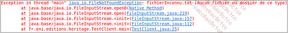
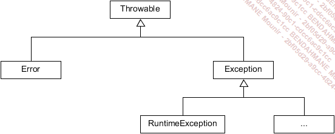

# JAVA

## La gestion des errerus en Java

### Les differents types d'erreurs

##### Les erreurs de syntaxe

Ce type d’erreur se produit au moment de la compilation lorsque le développeur fait une faute de frappe. Très fréquentes avec les outils de développement où l’éditeur de code et le compilateur sont deux entités séparées, elles deviennent de plus en plus rares avec les environnements de développement intégré (Eclipse, NetBeans, Jbuilder...). La plupart de ces environnements proposent une analyse syntaxique au fur et à mesure de la saisie du code.

Si une erreur de syntaxe est détectée, alors l’environnement propose des solutions possibles pour corriger cette erreur.

##### Les erreurs d'execution

Ces erreurs apparaissent après la compilation lorsque vous lancez l’exécution de votre application. La syntaxe du code est correcte, mais l’environnement de votre application ne permet pas l’exécution d’une instruction utilisée dans votre application. C’est par exemple le cas si vous essayez d’ouvrir un fichier qui n’existe pas sur le disque de votre machine. Vous obtiendrez sûrement un message de ce type :



Ce type de message n’est pas très sympathique pour l’utilisateur !

Heureusement, Java permet la récupération de ce type d’erreur et évite ainsi l’affichage de cet inquiétant message. Nous détaillerons cela un peu plus loin dans ce chapitre.

##### Les erreurs logiques

Ce sont les pires ennemies des développeurs. Tout se compile sans problème, tout s’exécute sans erreurs et pourtant "ça ne marche pas comme prévu" !!!

Il faut dans ce cas revoir la logique de fonctionnement de l’application. Les outils de débogage nous permettent de suivre le déroulement de l’application, de placer des points d’arrêt, de visualiser le contenu des variables, etc.

Ces outils ne remplacent cependant pas une bonne dose de réflexion (et parfois quelques comprimés d’aspirine).

### Les erreurs et leur representation objet en Java

Lorsqu’une erreur se produit au cours de l’exécution d’un programme, un objet est créé pour représenter l’erreur qui vient de se produire. Cet objet contient de nombreuses informations concernant l’erreur qui est survenue dans l’application, ainsi que l’état de l’application au moment de l’apparition de l’erreur. Cet objet est ensuite transmis à la machine virtuelle. C’est le déclenchement de l’exception.

La machine virtuelle doit alors rechercher une solution pour la gérer. Pour cela, elle explore les différentes méthodes ayant été appelées pour atteindre l’emplacement où l’erreur s’est produite. Dans ces différentes méthodes, elle recherche un gestionnaire d’exceptions capable de traiter le problème. La recherche débute par la méthode où l’exception a été déclenchée puis remonte jusqu’à la méthode main de l’application si besoin. Lorsqu’un gestionnaire d’exception adapté est trouvé, l’objet lui est transmis pour qu’il en assure le traitement. Si la recherche est infructueuse, l’application s’arrête.



Les exceptions vérifiées correspondent à une situation anormale au cours du fonctionnement de l’application. Cette situation est en général liée à un élément extérieur à l’application, comme par exemple une connexion vers une base de données ou une lecture de fichier. Ces exceptions sont représentées par des instances de la classe Exception ou de l’une de ses sous-classes. Elles doivent obligatoirement être traitées par un bloc try catch ou propagées au code appelant avec le mot-clé throws placé dans la signature de la fonction.
Les erreurs correspondent à des conditions exceptionnelles extérieures à l’application que celle-ci ne peut généralement pas prévoir. Ces exceptions sont représentées par une instance de la classe Error ou de l’une de ses sous-classes. Ces exceptions ne sont pas obligatoirement traitées. Il faut d’ailleurs préciser que lorsqu’elles surviennent, le fonctionnement de l’application est généralement très fortement compromis. Si elles sont gérées, la plupart du temps, le seul traitement consiste à afficher un message un peu moins effrayant pour l’utilisateur que celui proposé par défaut par la machine virtuelle Java. Dans pratiquement tous les cas, l’arrêt de l’application est inéluctable.
Les erreurs liées à une mauvaise utilisation d’une fonctionnalité du langage, ou à une erreur de logique dans la conception de l’application. L’erreur la plus fréquente que vous rencontrerez dans vos débuts avec Java sera certainement l’exception NullPointerException déclenchée lors de l’utilisation d’une variable non initialisée. Ces exceptions sont représentées par une instance de la classe RuntimeException ou une de ses sous-classes. Ces exceptions peuvent être traitées par des blocs try catch. Il n’est pas nécessaire de la faire à chaque fois. Par exemple, pour une exception de type NullPointerException, il est préférable d’analyser le code et de le modifier pour éviter qu’elles n’apparaissent. Pour d’autres exceptions, il est nécessaire de lire la javadoc pour comprendre pourquoi elle survient et déterminer s’il est opportun de la gérer.

### Les blocs try catch

La gestion des exceptions donne la possibilité de protéger un bloc de code contre les exceptions qui pourraient s’y produire. Le code "dangereux" doit être placé dans un bloc try. Si une exception est déclenchée dans ce bloc de code, le ou les blocs de code catch sont examinés. S’il en existe un capable de traiter l’exception, le code correspondant est exécuté, sinon l’exception est propagée vers la méthode appelante pour éventuellement être récupérée par un bloc catch de plus haut niveau. Une instruction finally permet de marquer un groupe d’instructions qui seront exécutées à la sortie du bloc try si aucune exception ne s’est produite, ou à la sortie d’un bloc catch si une exception a été déclenchée.

```java

try {
    // Instructions pouvant déclencher une exception
} catch (Exception1 e) {
    // Instructions de traitement de l'exception 1
} catch (Exception2 e) {
    // Instructions de traitement de l'exception 2
} finally {
    // Instructions exécutées dans tous les cas
}

```
