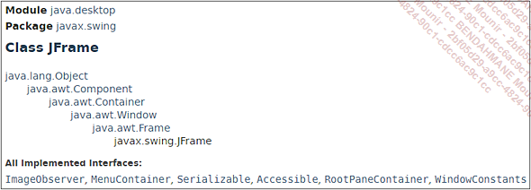
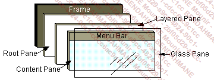

# JAVA

## La gestion des errerus en Java

### Les differents types d'erreurs

##### Les erreurs de syntaxe

Ce type d’erreur se produit au moment de la compilation lorsque le développeur fait une faute de frappe. Très fréquentes avec les outils de développement où l’éditeur de code et le compilateur sont deux entités séparées, elles deviennent de plus en plus rares avec les environnements de développement intégré (Eclipse, NetBeans, Jbuilder...). La plupart de ces environnements proposent une analyse syntaxique au fur et à mesure de la saisie du code.

Si une erreur de syntaxe est détectée, alors l’environnement propose des solutions possibles pour corriger cette erreur.

##### Les erreurs d'execution

Ces erreurs apparaissent après la compilation lorsque vous lancez l’exécution de votre application. La syntaxe du code est correcte, mais l’environnement de votre application ne permet pas l’exécution d’une instruction utilisée dans votre application. C’est par exemple le cas si vous essayez d’ouvrir un fichier qui n’existe pas sur le disque de votre machine. Vous obtiendrez sûrement un message de ce type :


Ce type de message n’est pas très sympathique pour l’utilisateur !

Heureusement, Java permet la récupération de ce type d’erreur et évite ainsi l’affichage de cet inquiétant message. Nous détaillerons cela un peu plus loin dans ce chapitre.

##### Les erreurs logiques

Ce sont les pires ennemies des développeurs. Tout se compile sans problème, tout s’exécute sans erreurs et pourtant "ça ne marche pas comme prévu" !!!

Il faut dans ce cas revoir la logique de fonctionnement de l’application. Les outils de débogage nous permettent de suivre le déroulement de l’application, de placer des points d’arrêt, de visualiser le contenu des variables, etc.

Ces outils ne remplacent cependant pas une bonne dose de réflexion (et parfois quelques comprimés d’aspirine).

### Les erreurs et leur representation objet en Java

Lorsqu’une erreur se produit au cours de l’exécution d’un programme, un objet est créé pour représenter l’erreur qui vient de se produire. Cet objet contient de nombreuses informations concernant l’erreur qui est survenue dans l’application, ainsi que l’état de l’application au moment de l’apparition de l’erreur. Cet objet est ensuite transmis à la machine virtuelle. C’est le déclenchement de l’exception.

La machine virtuelle doit alors rechercher une solution pour la gérer. Pour cela, elle explore les différentes méthodes ayant été appelées pour atteindre l’emplacement où l’erreur s’est produite. Dans ces différentes méthodes, elle recherche un gestionnaire d’exceptions capable de traiter le problème. La recherche débute par la méthode où l’exception a été déclenchée puis remonte jusqu’à la méthode main de l’application si besoin. Lorsqu’un gestionnaire d’exception adapté est trouvé, l’objet lui est transmis pour qu’il en assure le traitement. Si la recherche est infructueuse, l’application s’arrête.


Les exceptions vérifiées correspondent à une situation anormale au cours du fonctionnement de l’application. Cette situation est en général liée à un élément extérieur à l’application, comme par exemple une connexion vers une base de données ou une lecture de fichier. Ces exceptions sont représentées par des instances de la classe Exception ou de l’une de ses sous-classes. Elles doivent obligatoirement être traitées par un bloc try catch ou propagées au code appelant avec le mot-clé throws placé dans la signature de la fonction.
Les erreurs correspondent à des conditions exceptionnelles extérieures à l’application que celle-ci ne peut généralement pas prévoir. Ces exceptions sont représentées par une instance de la classe Error ou de l’une de ses sous-classes. Ces exceptions ne sont pas obligatoirement traitées. Il faut d’ailleurs préciser que lorsqu’elles surviennent, le fonctionnement de l’application est généralement très fortement compromis. Si elles sont gérées, la plupart du temps, le seul traitement consiste à afficher un message un peu moins effrayant pour l’utilisateur que celui proposé par défaut par la machine virtuelle Java. Dans pratiquement tous les cas, l’arrêt de l’application est inéluctable.
Les erreurs liées à une mauvaise utilisation d’une fonctionnalité du langage, ou à une erreur de logique dans la conception de l’application. L’erreur la plus fréquente que vous rencontrerez dans vos débuts avec Java sera certainement l’exception NullPointerException déclenchée lors de l’utilisation d’une variable non initialisée. Ces exceptions sont représentées par une instance de la classe RuntimeException ou une de ses sous-classes. Ces exceptions peuvent être traitées par des blocs try catch. Il n’est pas nécessaire de la faire à chaque fois. Par exemple, pour une exception de type NullPointerException, il est préférable d’analyser le code et de le modifier pour éviter qu’elles n’apparaissent. Pour d’autres exceptions, il est nécessaire de lire la javadoc pour comprendre pourquoi elle survient et déterminer s’il est opportun de la gérer.

### Les blocs try catch

La gestion des exceptions donne la possibilité de protéger un bloc de code contre les exceptions qui pourraient s’y produire. Le code "dangereux" doit être placé dans un bloc try. Si une exception est déclenchée dans ce bloc de code, le ou les blocs de code catch sont examinés. S’il en existe un capable de traiter l’exception, le code correspondant est exécuté, sinon l’exception est propagée vers la méthode appelante pour éventuellement être récupérée par un bloc catch de plus haut niveau. Une instruction finally permet de marquer un groupe d’instructions qui seront exécutées à la sortie du bloc try si aucune exception ne s’est produite, ou à la sortie d’un bloc catch si une exception a été déclenchée.

```java

try {
    // Instructions pouvant déclencher une exception
} catch (Exception1 e) {
    // Instructions de traitement de l'exception 1
} catch (Exception2 e) {
    // Instructions de traitement de l'exception 2
} finally {
    // Instructions exécutées dans tous les cas
}

```

## Les applications graphiques en Java

### Les bibliotheques graphiques

Le langage Java propose deux bibliothèques dédiées à la conception d’interfaces graphiques. La bibliothèque AWT et la bibliothèque Swing. Les principes d’utilisation sont quasiment identiques pour ces deux bibliothèques. L’utilisation simultanée de ces deux bibliothèques dans une même application peut provoquer des problèmes de fonctionnement et doit être évitée. Il existe une troisième bibliothèque, plus récente, nommée Java FX. Elle ne fait cependant plus partie de la plateforme Java SE standard. Ce chapitre n’abordera donc pas cette bibliothèque.

#### La bibliothèque AWT

La bibliothèque AWT (Abstract Window Toolkit) est la première bibliothèque graphique proposée par Java. Elle est disponible depuis la première version du langage. Elle est composée de deux packages : java.awt et java.awt.event. Le package java.awt contient les classes de base permettant la création d’interfaces graphiques. Le package java.awt.event contient les classes permettant la gestion des événements.

####  La bibliothèque Swing

ette bibliothèque a été conçue pour pallier les principales insuffisances de la bibliothèque AWT. Cette amélioration a été obtenue en écrivant entièrement cette bibliothèque en Java sans pratiquement faire appel aux services du système d’exploitation. Seuls quelques éléments graphiques (fenêtres et boîtes de dialogue) sont encore en relation avec le système d’exploitation. Pour les autres composants, c’est le code de la bibliothèque Swing qui détermine entièrement leurs aspects et comportements.

La bibliothèque Swing contient donc une quantité impressionnante de classes servant à redéfinir les composants graphiques. Il ne faut cependant pas penser que la bibliothèque Swing rend complètement obsolète la bibliothèque AWT. Beaucoup d’éléments de la bibliothèque AWT sont d’ailleurs repris dans la bibliothèque Swing. Nous utiliserons principalement cette bibliothèque dans le reste de ce chapitre.

#### Les composants graphiques SWING et java

La conception de l’interface graphique d’une application consiste essentiellement à créer des instances des classes représentant les différents éléments nécessaires, modifier les caractéristiques de ces instances de classe, les assembler et prévoir le code de gestion des différents événements pouvant intervenir au cours du fonctionnement de l’application. Une application graphique est donc constituée d’une multitude d’éléments superposés ou imbriqués. Parmi ces éléments, l’un d’entre eux joue un rôle prépondérant dans l’application. Il est souvent appelé conteneur de premier niveau. C’est lui qui va interagir avec le système d’exploitation et contenir tous les autres éléments. En général ce conteneur de premier niveau ne contient pas directement les composants graphiques mais d’autres conteneurs sur lesquels sont placés les composants graphiques. Pour faciliter la disposition de ces éléments les uns par rapport aux autres, nous pouvons utiliser l’aide d’un gestionnaire de mise en page. Cette superposition d’éléments peut être assimilée à une arborescence au sommet de laquelle nous avons le conteneur de premier niveau et dont les différentes branches sont constituées d’autres conteneurs. Les feuilles de l’arborescence correspondant aux composants graphiques.

Le conteneur de premier niveau étant l’élément indispensable de toute application graphique, nous allons donc commencer par étudier en détail ces caractéristiques et son utilisation puis nous étudierons les principaux composants graphiques.

#### La conception d'une interface graphique

Nous avons vu un petit peu plus haut que toute application graphique est au moins constituée d’un conteneur de premier niveau. La bibliothèque Swing dispose de trois classes permettant de jouer ce rôle :

**JApplet** : représente une fenêtre graphique embarquée à l’intérieur d’une page html pour être prise en charge par un navigateur. Cette classe n’a plus d’utilité depuis la plateforme Java 11 car la technologie des applets y a été abandonnée.

**JWindow** : représente une fenêtre graphique la plus rudimentaire qui soit. Celle-ci ne dispose pas de barre de titre, de menu système, pas de bordure, c’est en fait un simple rectangle sur l’écran. Cette classe est rarement utilisée sauf pour l’affichage d’un écran d’accueil lors du démarrage d’une application (splash screen).

**JFrame** : représente une fenêtre graphique complète et pleinement fonctionnelle. Elle dispose d’une barre de titre, d’un menu système, d’une bordure, elle peut facilement accueillir un menu, c’est bien sûr cet élément que nous allons utiliser dans la très grande majorité des cas.

Voici la hierarchie de classe de la classe JFrame :



Maintenant que nous sommes capables d’afficher une fenêtre, le plus gros de notre travail va consister à ajouter un contenu à la fenêtre. Avant de pouvoir ajouter quelque chose sur une fenêtre, il faut bien comprendre sa structure qui est relativement complexe. Un objet JFrame est composé de plusieurs éléments superposés jouant chacun un rôle bien spécifique dans la gestion de la fenêtre.



’élément RootPane correspond au conteneur des trois autres éléments. L’élément LayeredPane est lui responsable de la gestion de la position des éléments aussi bien sur les axes X et Y que sur l’axe Z ce qui permet la superposition de différents éléments. L’élément ContentPane est le conteneur de base de tous les éléments ajoutés sur la fenêtre. C’est bien sûr à lui que nous allons confier les différents composants de l’interface de l’application. Par-dessus le ContentPane, se superpose le GlassPane comme on le fait avec une vitre placée sur une photo. Il présente d’ailleurs beaucoup de similitudes avec la vitre.

Il est transparent par défaut.

Ce qui est dessiné sur le GlassPane masque les autres éléments.

Il est capable d’intercepter les événements liés à la souris avant que ceux-ci n’atteignent les autres composants.

De tous ces éléments, c’est incontestablement le ContentPane que nous allons le plus utiliser. Celui-ci est accessible par la méthode getContentPane de la classe JFrame. Il est techniquement possible de placer des composants directement sur l’objet ContentPane mais c’est une pratique déconseillée par Oracle. Il est préférable d’intercaler un conteneur intermédiaire qui lui va contenir les composants et de placer ce conteneur sur le ContentPane. Le composant JPanel est le plus couramment utilisé dans ce rôle.

Le scénario classique de conception d’une interface graphique consiste donc à créer les différents composants puis à les placer sur un conteneur et enfin à placer ce conteneur sur le ContentPane de la fenêtre. L’exemple suivant met cela en application en créant une interface utilisateur composée de trois boutons.

```java

import javax.swing.*;

public class Main {
    public static void main(String[] args)
    {
        JFrame fenetre = new JFrame("Ma première fenêtre Java");

         fenetre.setBounds(0,0,300,100);
          fenetre.setDefaultCloseOperation(JFrame.EXIT_ON_CLOSE);
          // création des trois boutons
          JButton b1,b2,b3;
          b1=new JButton("Rouge");
          b2=new JButton("Vert");
          b3=new JButton("Bleu");
          // création du conteneur intermédiaire
          JPanel pano;
          pano=new JPanel();
          // ajout des boutons sur le conteneur intermédiaire
          pano.add(b1);
          pano.add(b2);
          pano.add(b3);
          // ajout du conteneur intermédiaire sur le ContentPane
          fenetre.getContentPane().add(pano);
          // affichage de la fenêtre
          fenetre.setVisible(true);
    }
}
```

#### Le thread EDT

Lorsqu’une application Java sans interface graphique est exécutée, au moins deux threads sont exécutés :

Le thread principal (le thread main) dont le rôle est d’exécuter la méthode main du programme. C’est le point d’entrée obligatoire pour l’exécution d’une application Java SE standard.
Le thread du ramasse-miettes (garbage collector) pour nettoyer la mémoire lorsque celle-ci est occupée au-delà d’un certain seuil.
Un thread est tout simplement une unité d’exécution d’un programme. Un programme peut être composé d’un ou plusieurs threads. L’avantage d’avoir plusieurs threads est de permettre l’exécution de plusieurs tâches en parallèle. Prenons l’exemple d’un navigateur : il est très fréquent d’effectuer une requête vers un site et, en attendant son téléchargement et son affichage, de consulter une autre page, de visionner une vidéo… Tout cela est possible grâce à l’utilisation de différents threads.

Sur une machine multiprocesseur, les différents threads peuvent effectivement s’exécuter en parallèle en exploitant les différents processeurs. Sur une machine monoprocesseur, c’est la fréquence de transition entre les différents threads qui permet à l’utilisateur de penser que les tâches s’exécutent en parallèle. En effet, le processeur partage son temps entre les différents threads. Il n’exécute qu’un seul thread à la fois, mettant en pause les autres threads pendant ce temps. Ainsi, pour exécuter la totalité d’un thread, le processeur peut s’y prendre à plusieurs fois en mettant le thread en pause à plusieurs reprises pour exécuter les autres threads.

Pour exécuter une application Java avec une interface graphique, un troisième thread entre en jeu : c’est le thread EDT (Event Dispatching Thread). Ce thread est responsable de la gestion de l’interface graphique et de la gestion des événements (comme un clic sur un bouton).

Dans l’exemple précédent, l’interface graphique a été créée dans la méthode main et donc par le thread main. C’est donc le thread main qui est « propriétaire » des boutons présents sur l’interface graphique. Si l’utilisateur clique dessus, le thread EDT est sollicité pour réagir à cette action. Pour cela, le thread EDT a souvent besoin d’accéder aux éléments graphiques. Une opération inter-thread est donc nécessaire dans ce cas de figure. Et c’est là que les problèmes peuvent survenir. En effet, les composants graphiques ne sont pas thread safe. Cela signifie qu’un accès à partir d’un autre thread peut éventuellement causer un problème.

Pour éviter ce genre de situation, il est donc nécessaire de faire en sorte que seul le thread EDT manipule l’interface graphique, que ce soit pour la création de l’interface ou pour la gestion des événements. Il faut donc être capable, depuis le thread main qui exécute la méthode main, de demander au thread EDT de construire l’interface graphique de l’application. Ceci est possible par l’utilisation de la méthode invokeLater de la classe SwingUtilities. Cette méthode attend en paramètre un objet de type Runnable qui est une interface fonctionnelle contenant une seule méthode abstraite dont la signature est la suivante : void run(). Cet objet (ou cette expression lambda) définit simplement ce qui doit être exécuté par le thread EDT. Le code suivant apporte donc une modification essentielle à l’exemple précédent pour s’assurer du bon fonctionnement de l’application dans toutes les situations :
