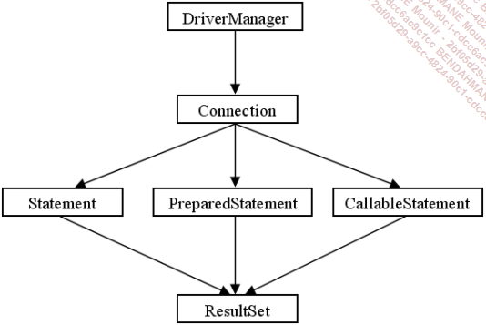

# Java

## Petits rappels de SQL

### Vocabulaire :

- **Base de données relationnelle** : une base de données relationnelle est un type de base de données qui utilise des tables pour le stockage des informations. Elles utilisent des valeurs issues de deux tables pour associer les données d’une table aux données d’une autre table. En règle générale, dans une base de données relationnelle, les informations ne sont stockées qu’une seule fois.
- **Table** : une table est un composant d’une base de données qui stocke les informations dans des enregistrements (lignes) et dans des champs (colonnes). Les informations sont en général regroupées par catégorie au niveau d’une table. Par exemple, nous aurons la table des Clients, des Produits, ou des Commandes.
- **Enregistrement** : l’enregistrement est l’ensemble des informations relatives à un élément d’une table. Les enregistrements sont les équivalents au niveau logique des lignes d’une table. Par exemple un enregistrement de la table Clients contient les caractéristiques d’un client particulier.
- **Champ** : un enregistrement est composé de plusieurs champs. Chaque champ d’un enregistrement contient une seule information sur l’enregistrement. Par exemple un enregistrement Client peut contenir les champs CodeClient, Nom, Prénom...
- **Clé primaire** : une clé primaire est utilisée pour identifier de manière unique chaque ligne d’une table. La clé primaire est un champ ou une combinaison de champs dont la valeur est unique dans la table. Par exemple, le champ CodeClient est la clé primaire de la table Client. Il ne peut pas y avoir deux clients ayant le même code.
- **Clé étrangère** : une clé étrangère représente un ou plusieurs champs d’une table qui font référence aux champs de la clé primaire d’une autre table. Les clés étrangères indiquent la manière dont les tables sont liées.
- **Relation** : une relation est une association établie entre des champs communs dans deux tables. Une relation peut être de un à un, un à plusieurs ou plusieurs à plusieurs. Grâce aux relations, les résultats de requêtes peuvent contenir des données issues de plusieurs tables. Une relation de un à plusieurs entre la table Client et la table Commande permet à une requête de renvoyer toutes les commandes correspondant à un client.

### Le langage SQL:

#### L'instruction `SELECT`

L'instruction `SELECT` permet de récupérer des données dans une base de données. Elle est utilisée avec d'autres instructions pour former une requête. L'instruction `SELECT` est suivie par une liste de colonnes à sélectionner.

```sql
SELECT Nom, Prénom, Adresse, Ville FROM Clients;
```

```sql
SELECT * FROM Clients;
```

##### La clause `WHERE`

La clause `WHERE` permet de spécifier `un` critère de sélection. Elle est utilisée pour filtrer les enregistrements et ne renvoyer que ceux qui correspondent aux critères spécifiés.

```sql
SELECT * FROM Clients WHERE Ville = 'Paris';
```

##### La clause `WHERE ... IN`

La clause `WHERE ... IN` permet de spécifier `des` critères de sélection. Elle est utilisée pour filtrer les enregistrements et ne renvoyer que ceux qui correspondent aux critères spécifiés.

```sql
SELECT * FROM Clients WHERE Ville IN ('Paris', 'Lyon');
```

##### La clause `WHERE ... BETWEEN`

```sql
SELECT * FROM Clients WHERE CodeClient BETWEEN 1000 AND 2000;
```

##### La clause `WHERE ... LIKE`

```sql
SELECT * FROM Clients WHERE Nom LIKE 'D%';
```

##### La clause `ORDER BY`

La clause `ORDER BY` permet de trier les résultats d'une requête. Elle est utilisée pour trier les enregistrements par ordre croissant ou décroissant.

```sql
SELECT * FROM Clients ORDER BY Nom ASC;
```

#### L'insertion de donnees

a création d’enregistrements dans une table se fait par la commande INSERT INTO. Vous devez indiquer la table dans laquelle vous souhaitez insérer une ligne, la liste des champs pour lesquels vous spécifiez une valeur et enfin la liste des valeurs correspondantes. La syntaxe complète est donc la suivante :

```sql
INSERT INTO table (champ1, champ2, champ3, ...) VALUES (valeur1, valeur2, valeur3, ...);
```

```sql
INSERT INTO Clients (CodeClient, Nom, Prénom, Adresse, Ville) VALUES (1000, 'Dupont', 'Jean', '1 rue de la Paix', NULL);
```

#### La mise à jour de donnees

La mise à jour d’enregistrements dans une table se fait par la commande UPDATE. Vous devez indiquer la table dans laquelle vous souhaitez mettre à jour une ou plusieurs lignes, la liste des champs à mettre à jour et enfin la liste des valeurs correspondantes. La syntaxe complète est donc la suivante :

```sql
UPDATE table SET champ1 = valeur1, champ2 = valeur2, ... WHERE condition;
```

```sql
UPDATE Clients SET Ville = 'Lyon' WHERE CodeClient = 1000;

UPDATE Clients SET Adresse = '29 montee de la boucle 69300 Caluire' WHERE Nom = 'DJEBLI' AND Prénom = 'Ayoub';
```

#### La suppression de donnees

La suppression d’enregistrements dans une table se fait par la commande DELETE. Vous devez indiquer la table dans laquelle vous souhaitez supprimer une ou plusieurs lignes et enfin la condition de suppression. La syntaxe complète est donc la suivante :

```sql
DELETE FROM table WHERE condition;
```

```sql
DELETE FROM Clients WHERE CodeClient = 1000;
```

## JDBC (Java DataBase Connectivity)

On parle d'API JDBC.



### Les étapes de connexion à une base de données

1. Charger le driver JDBC
   Petit tp : trouvez et installer le driver JDBC pour MySQL ou mariaDB:

- https://mvnrepository.com/artifact/mysql/mysql-connector-java/8.0.27
- https://downloads.mariadb.org/connector-java/
- https://downloads.mariadb.org/connector-java/2.7.4/
- ....

Recherchez mysql connector j ou mariadb connector j et telechargez un fichier .jar
Sur intelliJ :

- File
- Project Structure
- Modules
- Ajouter le jar dans le module
- Apply
- Ok

Petit TP SQL

Creer une application JAVA qui permet de se connecter à une base de données MySQL ou MariaDB et d'executer une requete SQL de votre choix. Une fois lancee l'application demande a l'utilisateur d'entrer une requete SQL, ensuite ecrire le resultat de la requete dans un fichier texte.
Pensez a la gestion d'excpetion et a la fermeture des ressources.
